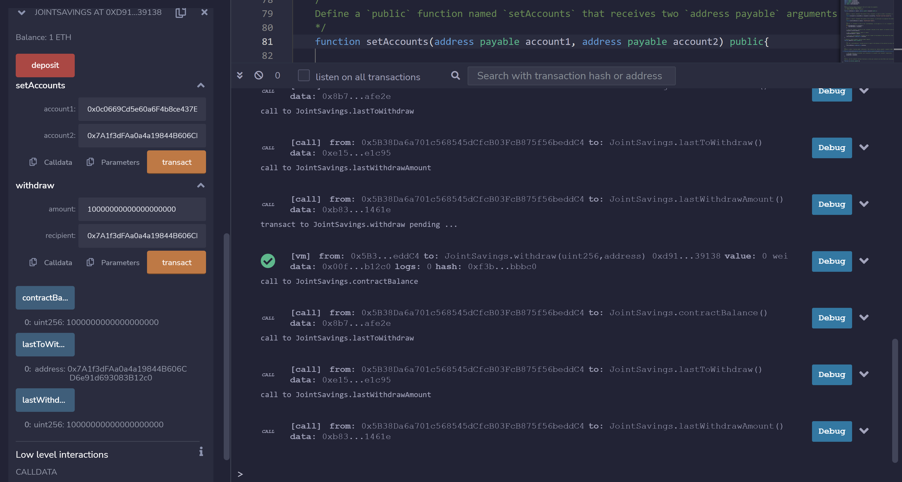

# Joint_Savings_Account

In this code I create a smart contract with Solidity to function as a joint savings account.

---

## Technologies

This code was written on Windows 11 running Solidity (0.5.0).
---

## Installation Guide

Solidity is the native language for the Ethereum Virtual Machine (EVM). It can be coded natively in Remix ide. To use the Remix ide either visit there website here: <https://remix.ethereum.org> or download the desktop app from there github here: <https://github.com/ethereum/remix-desktop/releases>

---

## Usage

To interact with this contract you must first compile it and then deploy it into a test enviornment. I used the Remix VM (London). Once it is dployed you can deposit to the contract, set the two accounts to withdraw to, and then withdraw funds to either one. There are also functions for checking the last withdrawal amount and address, as well as the remaining balance of the contract. Here is a screenshot of what you will see interacting with the contract through the Remix IDE.

---

## Contributors

Garrett Hernandez -gtkhhz@gmail.com

---

## License

This is free and unencumbered software released into the public domain.

Anyone is free to copy, modify, publish, use, compile, sell, or
distribute this software, either in source code form or as a compiled
binary, for any purpose, commercial or non-commercial, and by any
means.

In jurisdictions that recognize copyright laws, the author or authors
of this software dedicate any and all copyright interest in the
software to the public domain. We make this dedication for the benefit
of the public at large and to the detriment of our heirs and
successors. We intend this dedication to be an overt act of
relinquishment in perpetuity of all present and future rights to this
software under copyright law.

THE SOFTWARE IS PROVIDED "AS IS", WITHOUT WARRANTY OF ANY KIND,
EXPRESS OR IMPLIED, INCLUDING BUT NOT LIMITED TO THE WARRANTIES OF
MERCHANTABILITY, FITNESS FOR A PARTICULAR PURPOSE AND NONINFRINGEMENT.
IN NO EVENT SHALL THE AUTHORS BE LIABLE FOR ANY CLAIM, DAMAGES OR
OTHER LIABILITY, WHETHER IN AN ACTION OF CONTRACT, TORT OR OTHERWISE,
ARISING FROM, OUT OF OR IN CONNECTION WITH THE SOFTWARE OR THE USE OR
OTHER DEALINGS IN THE SOFTWARE.

For more information, please refer to <https://unlicense.org>
